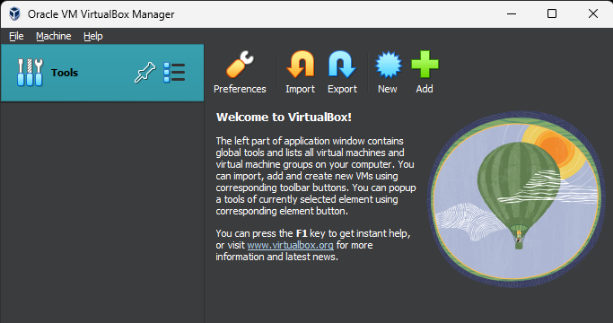
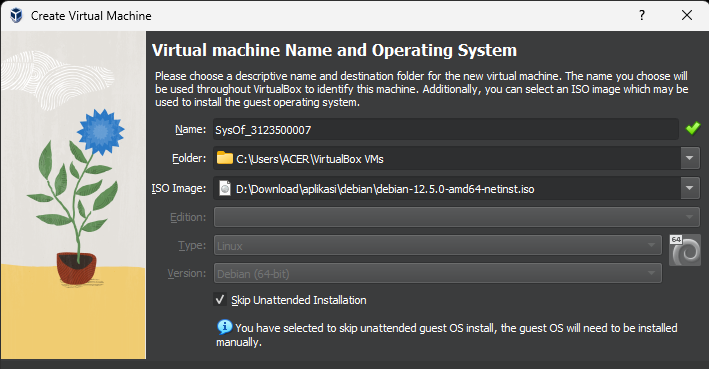

  <h1 style="text-align: center;font-weight: bold">Praktikum 1 SysOp</h1>
  <h4 style="text-align: center;">Dosen Pengampu : Dr. Ferry Astika Saputra, S.T., M.Sc.</h4>

 

  
  <h3 style="text-align: center;">Disusun Oleh : </h3>
  

    <strong>Roihanah Inayati Bashiroh (3123500005)</strong> 
    <strong>Dio Ramadhan Widya Pamungkas (3123500011)</strong> 
    <strong>Ragil Ridho Saputra (3122500016)</strong>
  

  <h3 style="text-align: center;line-height: 1.5">Politeknik Elektronika Negeri Surabaya Departemen Teknik
    Informatika Dan Komputer Program Studi Teknik Informatika 2023/2024</h3>
  

  

## Daftar Isi
1. [Pendahuluan](#sistem-operasi)
2. [Soal](#soal)
3. [Referensi](#referensi)

# Sistem Operasi
Sistem operasi adalah perangkat lunak yang bertanggung jawab untuk mengelola sumber daya perangkat keras dan menyediakan
antarmuka bagi pengguna dan aplikasi untuk berinteraksi dengan komputer. Ini mengkoordinasikan tugas-tugas seperti
alokasi memori, penjadwalan CPU, manajemen file, dan penyediaan layanan jaringan, memungkinkan pengguna untuk
menjalankan program dengan efisien dan menjalankan fungsi-fungsi dasar seperti mengetik, menyimpan, dan mengakses data.

# SOAL
# 1. Sebutkan dan jelaskan proses booting!
Proses booting adalah serangkaian langkah yang dilakukan oleh komputer ketika dinyalakan untuk mempersiapkan sistem agar
siap digunakan. Proses ini meliputi:

1. *Menghidupkan Komputer*: Saat tombol daya ditekan, sumber daya listrik dialirkan ke komputer.

2. *Tes Awal (POST)*: Komputer melakukan Power-On Self-Test (POST) untuk memeriksa perangkat keras utama seperti RAM,
prosesor, dan kartu grafis. Tujuannya adalah untuk memastikan bahwa semua perangkat keras berfungsi dengan baik sebelum
memuat sistem operasi.

3. *Inisialisasi Perangkat Keras*: Setelah POST, komputer menginisialisasi perangkat keras seperti hard drive, keyboard,
mouse, dan perangkat lainnya. Ini melibatkan pengenalan perangkat keras, pemuatan driver yang diperlukan, dan persiapan
perangkat untuk digunakan.

4. *Pencarian Sektor Boot*: Komputer mencari sektor boot, area khusus di hard drive yang berisi instruksi awal untuk
memuat sistem operasi.

5. *Memuat Sistem Operasi*: Setelah sektor boot ditemukan, sistem operasi dimuat ke dalam memori utama (RAM). Sistem
operasi kemudian mengambil alih kendali dan mulai menjalankan program-program yang diperlukan untuk mengoperasikan
komputer.

Proses booting memungkinkan komputer untuk memulai operasi normalnya dan siap digunakan oleh pengguna.

# 2. Bagaimana cara install Debian 12 di Virtualbox

1.Buka virtual box dan pilih tombol new untuk membuat virtual device

2.Beri nama untuk project nya dan pilih iso debian yang ada di storage dan checklist kolom skip

3.Atur berapa ram yang ingin di gunakan(sesuaikan dengan ram device) dan core cpu

4.Jika sudah maka klik finish untuk menyelesaikan setup

5.Akan terdapat pilihan proses booting nya debian pada halaman awal tadi

6.Klik 2 kali dan akan memasuki proses penginstalan debian dan pilih graphic install dan akan memunculkan halaman
tersebut dan pilih english

7.Pilih yes pada bagian install the GRUB boot loader dan pilih continue

8.Pilih Asia kemudian Indonesia sebagai lokasi kita dan klik continue

9.Saat konfigurasi lokal,pilih United States

10.Pada bagian konfigurasi keyboard,pilih American English

11.Tunggu instalasi sampai selesai,bila sudah selesai masukkan konfigurasi network untuk hostname dan untuk domain kita kosongkan

12.Atur Password untuk masuk(yang mudah di ingat)

13.Masukkan nama lengkap,username dan password(bedakan dari password sebelum nya) untuk setup user

14.Pilih zona untuk jam,dan pilih Western(tergantung tempat)

15.Untuk partition disk pilih manual dan pilih SCSI3 dan pilih yes pada create new empy partition table

16.Pilih pri/log,kemudian create new partition,atur ke 20GB,pilih primary,kemudian pilih beginning dan bootable flag ubah ke on dan pilih done

17.Setelah di partisi menjadi beberapa bagian,kemudian pilih finish dan tunggu instalasi sampai selesai

18.Pilih no pada scan extra installation,pilih indonesia untuk debian archive dan pilih kebo.pens dan kosongkan http
proxy

19.Tunggu konfigurasi sampai selesai

20.Setelah selesai,pilih yes pada participate in the package,pada software selection biarkan default

21.Tunggu sampai proses installasi software selesai(membutuhkan waktu sedikit lama)

22.Setelah selesai,pilih /dev/sda kemudian di halaman finish,klik continue dan debian sudah terinstall

# Referensi

  [Debian Download](https://www.debian.org/download)

  [VirtualBox Download](https://www.virtualbox.org/wiki/Downloads)

  

  
