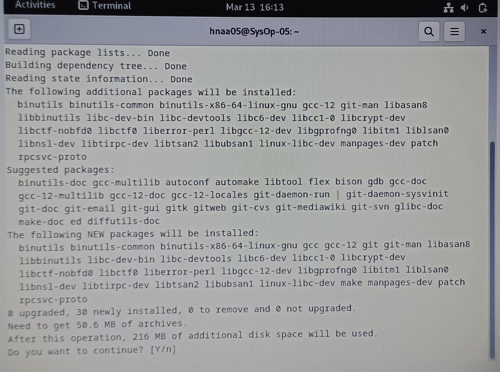
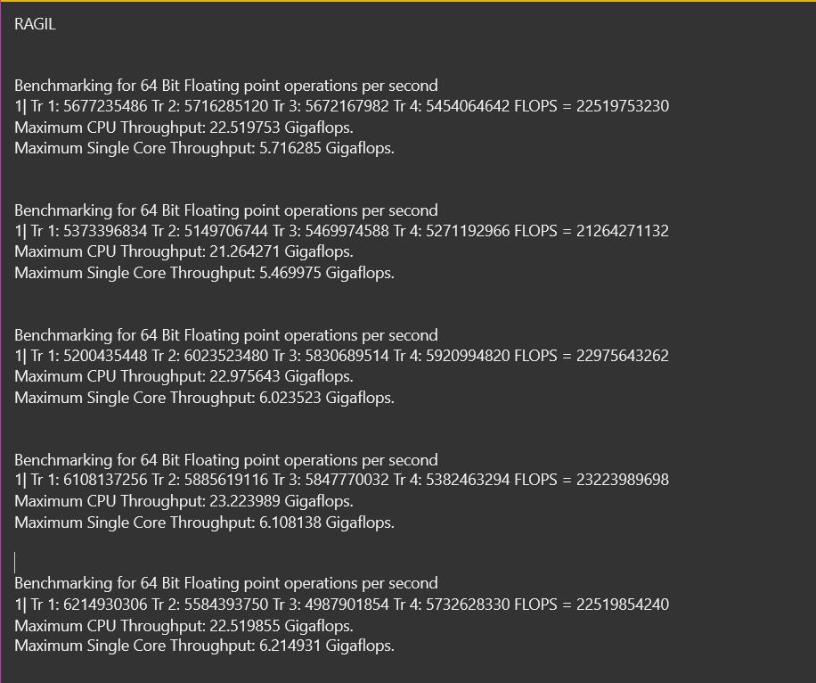
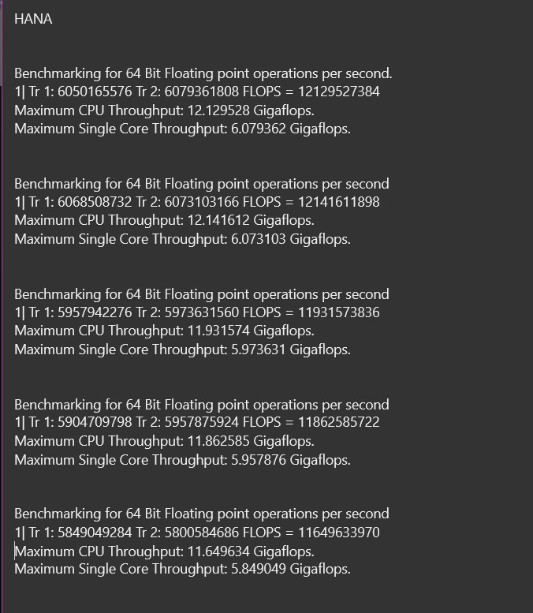

    <h1 style="text-align: center;font-weight: bold">Praktikum 2 SysOp</h1>
    <h4 style="text-align: center;">Dosen Pengampu : Dr. Ferry Astika Saputra, S.T., M.Sc.</h4>

 

    
    <h3 style="text-align: center;">Disusun Oleh : </h3>
    

        <strong>Roihanah Inayati Bashiroh (3123500005)</strong> 
        <strong>Dio Ramadhan Widya Pamungkas (3123500011)</strong> 
        <strong>Ragil Ridho Saputra (3122500016)</strong>
    

<h3>Politeknik Elektronika Negeri Surabaya Departemen Teknik
Informatika Dan Komputer Program Studi Teknik Informatika 2023/2024</h3>
    

    

## Daftar Isi

1. [PPT](#ppt)
2. [FLOPS dan IOPS](#flops-dan-iops) 
   [Install gcc, make, dan git](#install-gcc-make-dan-git) 
   [How to run FLOPS dan IOPS](#how-to-run-flops-dan-iops) 
   [Tabel Pengujian](#tabel-pengujian) 
   [Analisa](#analisa)
3. [Referensi](#referensi)

## PPT

[Link PPT](https://www.canva.com/design/DAF_Q_JAZRc/i6EOGG2lMCJPxMgpVESW0g/view?utm_content=DAF_Q_JAZRc&utm_campaign=designshare&utm_medium=link&utm_source=editor)

## FlOPS dan IOPS

### Install GCC, make, dan GIT

### How to run FLOPS dan IOPS

1. Ragil
   Percobaan FLOPS64 5 kali
   
   Percobaan IOPS64 5 kali
   
2. Hana
   Percobaan FLOPS64 5 kali
   
   Percobaan IOPS64 5 kali
   
3. Dio
   Percobaan FLOPS64 5 kali
   
   Percobaan IOPS64 5 kali
   

### Tabel Pengujian

| Nama Anggota | Max Single Core FLOPS | Max Single Core IOPS | Max CPU FLOPS | Max CPU IOPS |
| ------------ | --------------------- | -------------------- | ------------- | ------------ |
| Ragil        | 6.2                   | 5.5                  | 23.2          | 22           |
| Hana         | 6                     | 6.6                  | 12.1          | 13.2         |
| Dio          | 10.8                  | 10.1                 | 21.6          | 20.2         |

#### Analisa

Berdasarkan hasil pengujian kami, kinerja sistem dalam melakukan operasi floating point 64-bit menunjukkan variasi yang signifikan, dengan throughput CPU maksimum berkisar antara 9.98 hingga 23.22 Gigaflops. Sementara itu, operasi integer 64-bit menunjukkan fluktuasi yang lebih terkendali, dengan throughput CPU maksimum berkisar antara 12.72 hingga 13.22 Gigaiops. Meskipun throughput CPU maksimum pada operasi floating point biasanya lebih tinggi daripada operasi integer, perlu diperhatikan bahwa nilai throughput maksimum pada satu inti cenderung lebih rendah daripada throughput CPU maksimum, menyoroti adanya pembatasan kinerja yang bukan hanya berasal dari kemampuan pemrosesan inti tunggal. Oleh karena itu, dalam memilih sistem untuk aplikasi tertentu, penting untuk mempertimbangkan jenis operasi yang dominan dan memilih sistem dengan throughput yang sesuai dengan kebutuhan kinerja aplikasi tersebut.

### Kesimpulan

Berdasarkan hasil pengujian kelompok kami, kinerja sistem bervariasi tergantung pada jenis operasi yang dilakukan. Operasi floating point 64-bit menunjukkan fluktuasi yang signifikan dalam throughput CPU, sementara operasi integer 64-bit menunjukkan fluktuasi yang lebih kecil. Meskipun demikian, throughput CPU maksimum pada operasi floating point biasanya lebih tinggi daripada operasi integer. Ini menyoroti pentingnya mempertimbangkan jenis operasi yang dominan dalam aplikasi yang akan dijalankan, serta memilih sistem dengan throughput yang sesuai untuk memenuhi kebutuhan kinerja aplikasi tersebut.

## Referensi

- [Apa itu CPU?](https://www.youtube.com/watch?v=Z5JC9Ve1sfI)
- [Siklus CPU](https://www.youtube.com/watch?v=jFDMZpkUWCw)
- [FLOPS dan IOPS](https://github.com/ferryastika/flops-iops)
