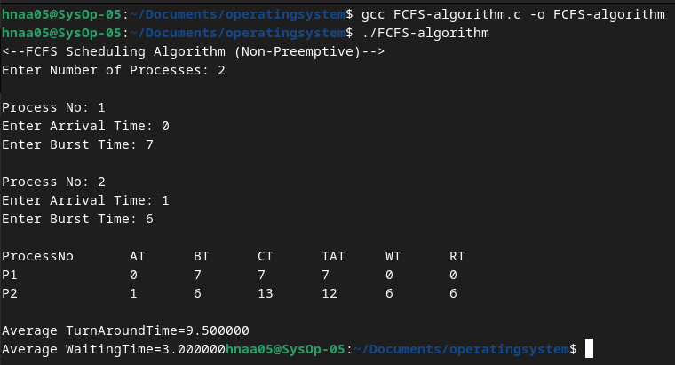
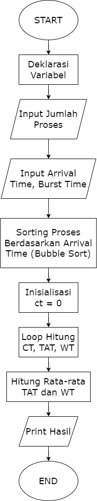
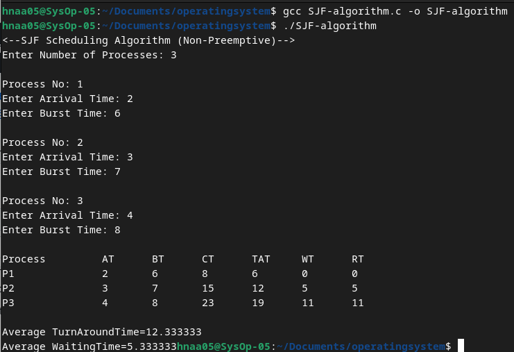
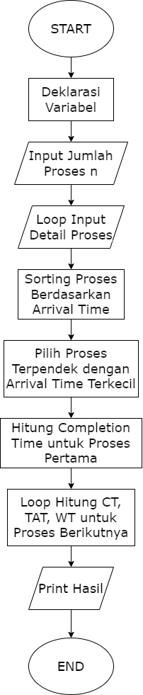
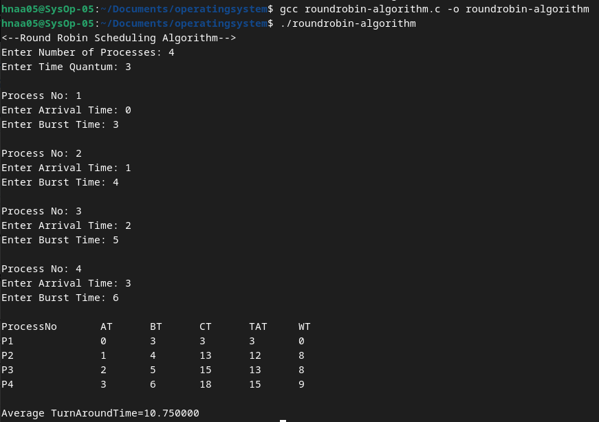
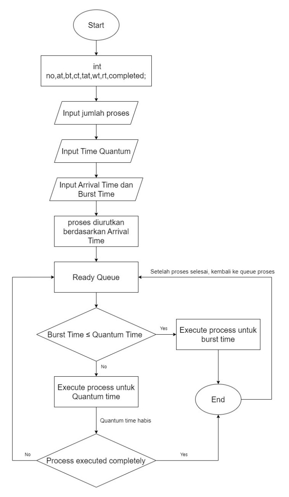

    <h1 style="text-align: center;font-weight: bold">Praktikum 11 SysOp</h1>
    <h4 style="text-align: center;">Dosen Pengampu : Dr. Ferry Astika Saputra, S.T., M.Sc.</h4>

 

    
    <h3 style="text-align: center;">Disusun Oleh : </h3>
    

        <strong>Roihanah Inayati Bashiroh (3123500005)</strong> 
        <strong>Dio Ramadhan Widya Pamungkas (3123500011)</strong> 
        <strong>Ragil Ridho Saputra (3122500016)</strong>
    

<h3>Politeknik Elektronika Negeri Surabaya Departemen Teknik
Informatika Dan Komputer Program Studi Teknik Informatika 2023/2024</h3>
    

    

## Daftar Isi
- [First Come First Serve Algorithm](#first-come-first-serve-algorithm)
- [Shortest Job First Algorithm](#shortest-job-first-algorithm)
- [Round Robin Algorithm](#round-robin-algorithm)

# Scheduling Algorithm

## First Come First Serve Algorithm
### Percobaan Running Program

    
### Flowchart First Come First Serve Algorithm

### Analisis

## Shortest Job First Algorithm
### Percobaan Running Program

### Flowchart Shortest Job First Algorithm

### Analisis

## Round Robin Algorithm
### Percobaan Running Program

### Flowchart Round Robin Algorithm

### Analisis

