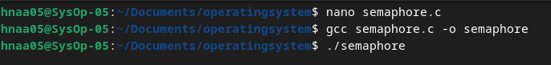
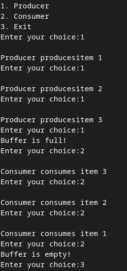
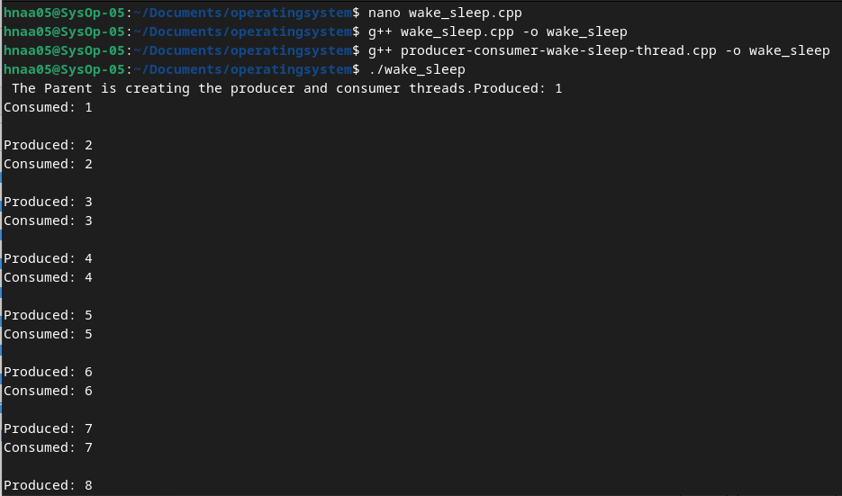

    <h1 style="text-align: center;font-weight: bold">Praktikum 9 SysOp</h1>
    <h4 style="text-align: center;">Dosen Pengampu : Dr. Ferry Astika Saputra, S.T., M.Sc.</h4>

 

    
    <h3 style="text-align: center;">Disusun Oleh : </h3>
    

        <strong>Roihanah Inayati Bashiroh (3123500005)</strong> 
        <strong>Dio Ramadhan Widya Pamungkas (3123500011)</strong> 
        <strong>Ragil Ridho Saputra (3122500016)</strong>
    

<h3>Politeknik Elektronika Negeri Surabaya Departemen Teknik
Informatika Dan Komputer Program Studi Teknik Informatika 2024/2025</h3>
    

    

## Producer Consumer Semaphore

Analisa: Program ini merupakan contoh implementasi dari masalah Producer-Consumer menggunakan semaphore dalam bahasa C. Dalam program ini, terdapat tiga opsi menu: "Producer", "Consumer", dan "Exit". Ketika opsi "Producer" dipilih, program akan menciptakan data dengan maksimum tiga data. Jika pengguna terus memilih opsi "Producer" tanpa memilih opsi lain lebih dari tiga kali, program akan menampilkan pesan "Buffer your full!!". Sebaliknya, jika opsi "Consumer" dipilih dan pengguna terus memilihnya tanpa memilih opsi lain lebih dari tiga kali, program akan menampilkan pesan "Buffer is empty!!". Opsi "Exit" digunakan untuk keluar dari program.

## Producer Consumer Wake-Sleep thread

Analisa : Contoh program ini mengimplementasikan permasalahan Produsen Konsumen menggunakan semaphore dan thread dalam bahasa C++. Dalam skenario ini, thread digunakan untuk menjalankan produsen dan konsumen secara bersamaan. Dengan menggunakan konsep kunci gembok (mutex) dan variabel kondisi sebagai lampu lalu lintas, program menjamin bahwa hanya satu proses yang dapat mengakses sumber daya pada satu waktu tertentu. Ketika produsen menghasilkan barang, ia memberi tahu konsumen bahwa barang baru telah tersedia. Begitu pula ketika konsumen mengonsumsi barang, ia memberi tahu produsen bahwa barang tersebut telah diambil. Dengan demikian, program memastikan bahwa proses produksi dan konsumsi berjalan dengan aman dan terkoordinasi.

### Referensi

- [Producer Consumer Problem](https://www.geeksforgeeks.org/producer-consumer-problem-in-c/)
